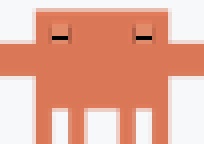
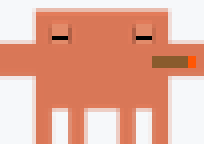
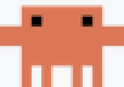
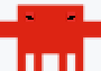
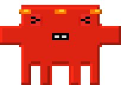
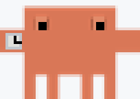

# Claude Control Bar

[English](README.md) | **Русский**

https://github.com/user-attachments/assets/39381f85-c8ce-4d32-8baa-dce67d39ee7e

Приложение для строки меню macOS, спутник **Claude Code**. Показывает, чем Claude занят, и даёт управлять сессиями, MCP-серверами и лимитами прямо из меню.

- **Сессии.** Анимированная иконка, пока Claude работает, жёлтая точка, когда он ждёт вашего разрешения, таймер хода и процент занятого контекста у каждой сессии. Клик по сессии поднимает терминал или редактор, где она запущена.
- **MCP.** У каждого сервера и каждого инструмента свой выключатель. Выключенный инструмент пропадает из контекста Claude при следующем старте сессии.
- **Лимиты.** Полоски 5-часового и 7-дневного лимитов прямо в строке меню, время сброса видно в самом меню.

## Установка

### Плагином Claude Code (рекомендуется)

```bash
/plugin marketplace add InfinityScripter/claude-control-bar
```

```bash
/plugin install claude-control-bar
```

Приложение собирается из исходников на вашем Mac при следующем старте сессии, для этого нужны Xcode Command Line Tools (`xcode-select --install`). Обновляется вместе с плагином.

### DMG

1. Скачайте `claude-control-bar.dmg` из [последнего релиза](../../releases/latest).
2. Перетащите **Claude Control Bar** в «Программы».
3. Запустите один раз, чтобы установились хуки.

> [!IMPORTANT]
> DMG не нотаризован, поэтому macOS заблокирует первый запуск. Откройте **Системные настройки → Конфиденциальность и безопасность** и нажмите **Всё равно открыть**. Или снимите карантин командой
> `xattr -dr com.apple.quarantine "/Applications/Claude Control Bar.app"`.

Ставьте что-то одно. Если установлены оба канала, каждый хук срабатывает дважды. Приложение умеет разруливать этот конфликт в пользу плагина, но держать оба всё равно незачем.

## Как пользоваться

Открывать приложение не нужно: оно запускается вместе с первой сессией Claude Code и закрывается, когда сессий не остаётся. Сессии, лимиты, выключатели MCP и настройки живут в иконке в строке меню.

### Маскот-краб

**Crab Walking** — анимация по умолчанию при новой установке. Маскот меняется в зависимости от числа сессий Claude Code, которые работают параллельно прямо сейчас. Считаются только сессии, где Claude думает или выполняет инструмент; просто открытые и бездействующие сессии не влияют.

| Работающих сессий | Что делает краб |
| ---: | --- |
| 0 | Спит |
| 1 | Отдыхает с сигарой |
| 2–3 | Ходит как в исходной анимации |
| 4–5 | Краснеет, качается и потеет |
| 6+ | У него загорается голова |

В этих превью используются те же runtime-кадры и тайминг, что и в приложении:

| 0 · Сон | 1 · Сигара | 2–3 · Ходьба |
| :---: | :---: | :---: |
|  |  |  |
| 4–5 · Перегрев | 6+ · В огне | Нужно разрешение |
|  |  |  |

Когда сессии нужно разрешение, краб переключается на отдельную сцену ожидания: смотрит на часы, затем в экран. Рядом остаётся жёлтый предупреждающий кружок, а в строке состояния появляется короткая надпись `Needs you`. После ответа краб возвращается к состоянию для текущего числа работающих сессий.

Выключатели серверов и инструментов действуют на новые сессии: Claude Code собирает список инструментов на старте, уже открытые сессии работают со старым набором.

Цифры лимитов приложение берёт с той же ручки Anthropic, что и команда `/usage`. Для запроса используется OAuth-токен из Keychain, который туда положил сам Claude Code. Уходит он только на `api.anthropic.com`, а опрос можно выключить в настройках. Полный список файлов, которые приложение пишет, и запросов, которые оно делает, лежит в [PRIVACY.md](PRIVACY.md).

## Требования

- macOS 12+
- [Claude Code](https://claude.com/claude-code) (CLI или Desktop-приложение)
- Node.js и системный `/usr/bin/python3`
- Xcode Command Line Tools нужны только плагину (он собирает приложение локально), для DMG не нужны

## Удаление

Если ставили плагином: `/plugin uninstall claude-control-bar`, потом перетащите `~/Applications/Claude Control Bar.app` в Корзину.

Если ставили из DMG:

```bash
node "/Applications/Claude Control Bar.app/Contents/Resources/uninstall.js"
```

Скрипт убирает хуки, дальше перетащите приложение в Корзину. Служебные файлы лежат в `~/.claude/control-bar/`.

## Если что-то не работает

Смотрите [TROUBLESHOOTING.md](TROUBLESHOOTING.md).

## Благодарности и лицензия

Проект вырос из [claude-status-bar](https://github.com/m1ckc3s/claude-status-bar) Мика Цесанека, к которому присоединился [claude-mcp-bar](https://github.com/InfinityScripter/claude-mcp-bar). Список контрибьюторов — в [ACKNOWLEDGEMENTS.md](ACKNOWLEDGEMENTS.md).

Лицензия MIT, текст в [LICENSE](LICENSE). Проект неофициальный, Anthropic к нему отношения не имеет. «Claude» — товарный знак Anthropic.
